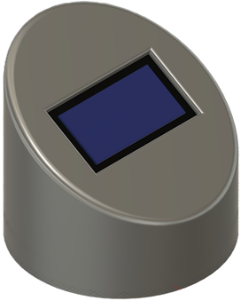
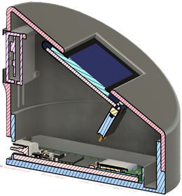

# Arduino Weather Station

## Project Overview

This repository contains a complete implementation of a connected weather station based on the Arduino Nano ESP32 microcontroller. The system reads environmental data (temperature and humidity) from a compact I2C sensor, displays real-time information on an integrated OLED display, and synchronizes time via Wi-Fi and NTP protocol.

The project is designed for autonomous operation, with support for battery-powered deployments, automatic USB-based debug detection, and minimal power consumption.

 

## Features

- **Environmental Monitoring**: Real-time temperature and humidity acquisition via DHT20 (AHT20) sensor
- **Local Display**: Structured multi-line information display on 128x64 SH1106 OLED screen
- **Network Connectivity**: Wi-Fi integration for seamless network access
- **Time Synchronization**: Automatic clock synchronization using NTP (be.pool.ntp.org)
- **Local Preference Storage**: Key/value preference helpers stored in FFat flash storage
- **Reusable Preference Module**: FFat preference helpers extracted into shared source files for reuse across sketches
- **Reusable Display Module**: SH1106 display rendering helpers extracted into shared source files for reuse across sketches
- **Smart Debug System**: Conditional logging that automatically detects USB connection
- **Production Ready**: Modular architecture with clean separation of concerns
- **Low Power**: Designed for battery-powered deployment with minimal overhead

## Hardware Requirements

| Component | Specification | Protocol | I2C Address |
|-----------|---------------|----------|-------------|
| Microcontroller | Arduino Nano ESP32 | - | - |
| Temperature/Humidity Sensor | DHT20 (AHT20) | I2C | 0x38 |
| Display | SH1106 OLED 128×64 | I2C | 0x3C |

### Pin Configuration

| Function | Pin |
|----------|-----|
| I2C SDA | GPIO 21 |
| I2C SCL | GPIO 22 |

## Software Dependencies

The project requires the following Arduino libraries:

```
- esp32 (Espressif ESP32 Board Core)
- Adafruit AHTX0
- Adafruit GFX
- Adafruit SH110X
```

### External Services

- **NTP Server**: be.pool.ntp.org (for time synchronization)

## Installation & Setup

### 1. Arduino IDE Configuration

Ensure your Arduino IDE is configured with:
- **Board**: Arduino Nano ESP32
- **Port**: COM port where the device is connected
- **Board Manager**: Install Espressif ESP32 board package

### 2. Library Installation

Install required libraries through the Arduino IDE Library Manager:

```
Sketch → Include Library → Manage Libraries...
```

Search for and install:
- `Adafruit AHTX0`
- `Adafruit GFX`
- `Adafruit SH110X`

### 3. Configuration

Edit the following parameters in `WeatherStation.ino`:

```cpp
// Wi-Fi credentials
const char* WIFI_SSID = "YOUR_NETWORK_SSID";
const char* WIFI_PASSWORD = "YOUR_NETWORK_PASSWORD";

// Timezone configuration (in seconds)
const long GMT_OFFSET_SEC = 0;        // Base timezone offset
const int DAYLIGHT_OFFSET_SEC = 3600; // Daylight saving adjustment
```

### 4. Hardware Assembly

1. Connect the DHT20 sensor to I2C pins (SDA: GPIO 21, SCL: GPIO 22)
2. Connect the SH1106 OLED display to the same I2C bus
3. Ensure all I2C devices have unique addresses (0x38 for sensor, 0x3C for display)
4. Add pull-up resistors (4.7kΩ) to SDA and SCL lines if not present on modules

### 5. Upload & Verification

1. Open `WeatherStation.ino` in Arduino IDE
2. Upload the sketch to your Arduino Nano ESP32
3. Monitor serial output via USB (if connected) to verify successful initialization

## Operation

### Startup Sequence

1. **Debug Initialization**: Detects USB connection for optional serial output
2. **I2C Bus Setup**: Initializes SDA/SCL communication lines
3. **DHT20 Detection**: Verifies sensor presence and functionality
4. **Display Initialization**: Validates OLED display and configures rotation
5. **Wi-Fi Connection**: Connects to the specified network and waits until association succeeds
6. **Time Synchronization**: Retrieves current time via NTP

### Runtime Display

The OLED screen shows a formatted layout with:
- **Header**: Current time (`HH:MM:SS` when NTP is available)
- **Temperature**: Current temperature in °C
- **Humidity**: Current relative humidity in %
- **Footer**: Current Wi-Fi IP address

Updates occur automatically every 1 second.

### Debug Output

When USB is connected, the system enables serial debug output at 115200 baud, displaying:
- Sensor initialization status
- Wi-Fi connection progress
- Time synchronization status
- Optional preference file diagnostics when the helper functions are used

When running disconnected (battery mode), debug output is automatically disabled to reduce power consumption.

## Architecture

### Core Modules

| Function | Purpose |
|----------|---------|
| `setup()` | One-time initialization of hardware and network |
| `loop()` | Main execution cycle: sensor read → display update |
| `WeatherDisplay.h/.cpp` | Shared SH1106 rendering helpers for status and dashboard screens |
| `getTimeString()` | Formats current time as readable string |
| `FFatPreferences.h/.cpp` | Shared FFat-backed helpers for reading and updating key/value settings |
| `initDebug()` | Smart debug initialization |

### Key Design Decisions

- **I2C Communication**: Both sensor and display share the same I2C bus to reduce pin usage
- **Modular Functions**: Each display format and operation is encapsulated in dedicated functions
- **Dynamic Debug**: Debug macros (`debugPrint`, `debugPrintln`) reduce overhead when disabled
- **NTP Time Sync**: Automatic synchronization eliminates need for real-time clock module
- **Simple Blocking Startup**: The current implementation waits for Wi-Fi and initial time synchronization during startup for deterministic boot behavior

## Technical Specifications

| Parameter | Value |
|-----------|-------|
| Display Resolution | 128 × 64 pixels |
| Temperature Accuracy | ±0.3°C (typical) |
| Humidity Accuracy | ±2% RH (typical) |
| Sensor Update Rate | ~1 Hz |
| I2C Clock Speed | 100 kHz (standard) |
| Serial Baud Rate | 115200 |
| Operating Voltage | 3.3V (ESP32) |

## Enclosure & Mechanical Design

A 3D-printed enclosure has been designed in **Fusion 360** (see `Fusion 360/WeatherStation.f3z`). The design accommodates:
- Arduino Nano ESP32 mounting
- DHT20 sensor with ventilation slots
- SH1106 display with clear viewing window
- I2C connector access
- Power input terminals

### 3D Model Details

The Fusion 360 project includes:
- Dimensioned technical drawings
- Assembly instructions
- Component placement guides
- Optional mounting bracket designs

## Power Considerations

### Current Consumption (Typical)

- **ESP32 Active**: ~160 mA
- **Display (OLED)**: ~20 mA
- **DHT20 Sensor**: <1 mA
- **Total Average**: ~181 mA

### Battery Operation

For battery-powered deployments:
1. USB debug output is automatically disabled (reduces overhead)
2. Update interval can be extended via `delay()` modification
3. Wi-Fi connection can be optimized with power-saving modes (advanced)
4. Consider 3000+ mAh lithium battery for continuous operation

## Troubleshooting

### Common Issues

| Issue | Symptom | Solution |
|-------|---------|----------|
| DHT20 Not Detected | Error message on startup | Verify I2C wiring; check address (0x38) with I2C scanner |
| Display Not Visible | Screen remains blank | Ensure I2C address (0x3C) is correct; verify power supply |
| Wi-Fi Connection Fails | Startup blocks on connection attempt | Verify SSID and password; check signal strength |
| Time Not Synced | "Time not available" message | Verify NTP server accessibility; check internet connection |
| No Serial Output | Missing debug messages | Ensure USB is properly connected; check baud rate (115200) |

### Debug Mode

To enable forced debug output (even without USB):

```cpp
// In setup() function, after initDebug():
debugEnabled = true;  // Force enable debug output
```

## Changelog

### 2026-03-25

#### Added

- Added a formal project changelog to track functional and documentation changes over time.
- Added README documentation for local FFat-based preference storage helpers already present in the sketch.

#### Changed

- Expanded the feature list to mention persistent key/value preference storage.
- Expanded the architecture overview to include preference management helper functions.
- Aligned the README with the current sketch state so documented functionality matches the code currently in the repository.

#### Documentation

- Consolidated project information into a clearer structure covering setup, operation, architecture, power considerations, and troubleshooting.
- Kept the project status and update date current for the latest repository revision.

### 2026-03-25 README Review

#### Changed

- Corrected the startup description to reflect the current blocking Wi-Fi and NTP initialization behavior in the sketch.
- Corrected the OLED runtime display description so it matches the actual screen layout: time in the header, sensor values in the middle, and IP address in the footer.
- Adjusted the debug output section to remove claims about periodic sensor logs that are currently commented out in the sketch.

#### Fixed

- Fixed architecture documentation that previously described initialization as non-blocking although the current implementation is blocking.
- Fixed the Wi-Fi troubleshooting entry so it matches the actual runtime symptom observed with the current code.

## Future Enhancements

Potential improvements for future versions:

- **Cloud Upload**: MQTT or REST API for remote data transmission
- **Web Interface**: Simple web server for local network access
- **Multiple Sensors**: Support for multiple sensor nodes with aggregation
- **Calibration**: User-adjustable sensor offset calibration
- **Low Power Modes**: Sleep scheduling to extend battery life

## File Structure

```
Arduino WeatherStation/
├── Arduino/
│   └── Nano ESP32/
│       └── WeatherStation/
│           ├── FFatPreferences.cpp     # Shared FFat preference helper implementation
│           ├── FFatPreferences.h       # Shared FFat preference helper declarations
│           ├── WeatherDisplay.cpp      # Shared SH1106 display helper implementation
│           ├── WeatherDisplay.h        # Shared SH1106 display helper declarations
│           └── WeatherStation.ino      # Main sketch
├── Fusion 360/
│   └── WeatherStation.f3z              # 3D enclosure design
└── README.md                           # This file
```

## License & Attribution

**Author**: Nicolas Debras

This project is provided as-is for educational and personal use. Modifications and adaptations are welcome for non-commercial purposes.

## Support & Contributions

For issues, questions, or improvements, please review:
- Arduino IDE troubleshooting guides
- Adafruit library documentation
- ESP32 pinout references
- I2C protocol specifications

---

**Last Updated**: March 25, 2026  
**Status**: Under development
